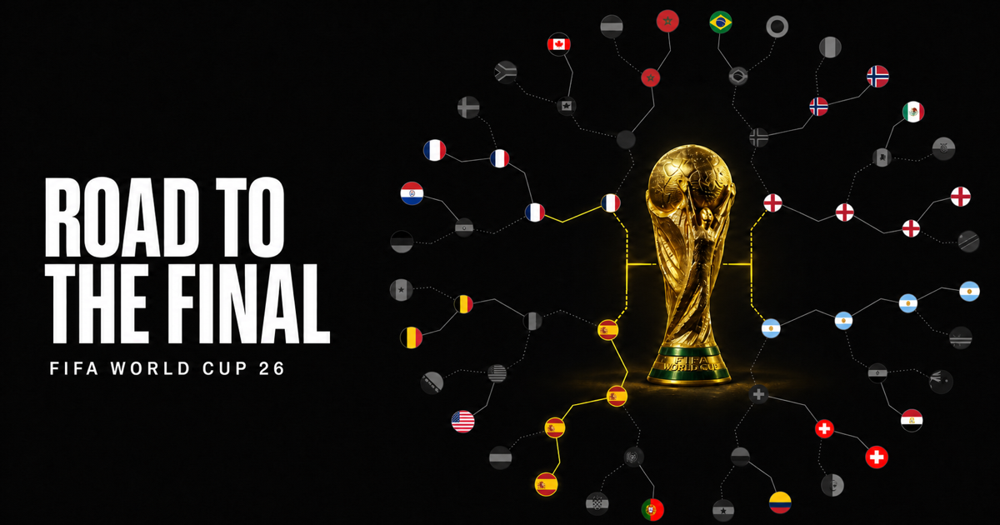

# FIFA World Cup 26 bracket

Designed and built with the [Better Design MCP](https://better-design.com/), which gives coding agents access to design systems, UI principles, and UX guidance.

An interactive radial World Cup bracket built with Next.js, React Flow, and Three.js.

[](https://world-cup-26-bracket-gamma.vercel.app/)

[View the live app](https://world-cup-26-bracket-gamma.vercel.app/)

## Run locally

```bash
npm install
npm run dev
```

Open [http://localhost:3000](http://localhost:3000).

## Production build

```bash
npm run build
npm start
```

Asset credits are included in [`public/models`](public/models) and [`public/stadiums`](public/stadiums).
